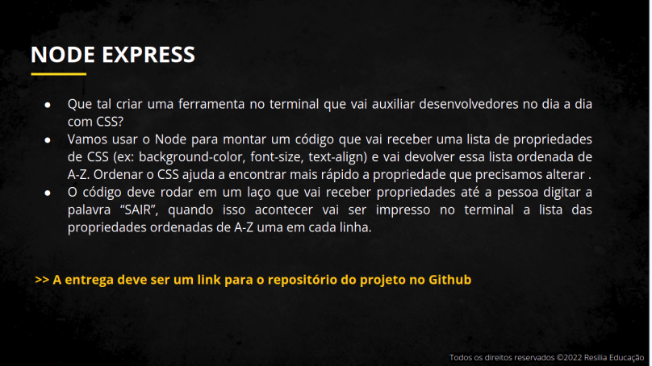

# Sprint1 Modulo4 - Resilia Educação

 

### Para a aplicação funcionar:

- Faça um clone do projeto;

- use o comando:  $ npm init -y, para inicializar um projeto node(baixa a pasta node-modules), no diretorio onde foi feito o clone do projeto; 

- instale a o pacote inquirer com o comando: $ npm install inquirer, no mesmo diretorio.

